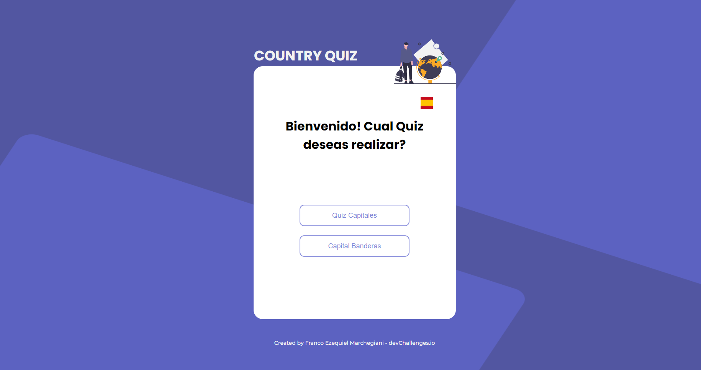
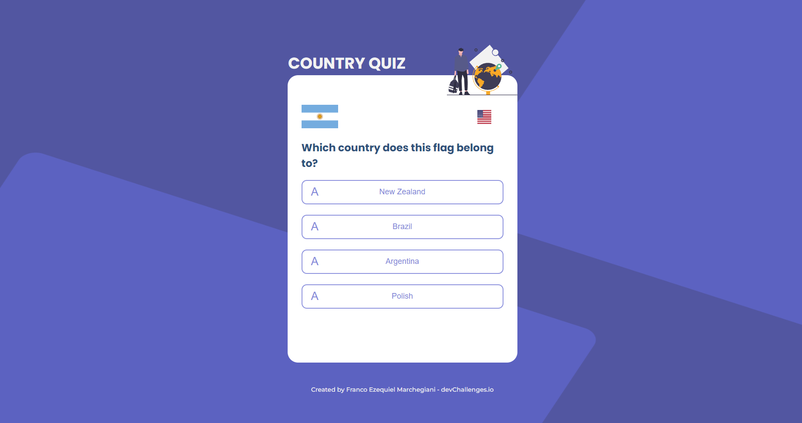

<h1 align="center">Quiz App Game</h1>

<div align="center">
   Solution for a challenge from  <a href="http://devchallenges.io" target="_blank">Devchallenges.io</a>.
</div>

<div align="center">
  <h3>
    <a href="https://{your-url-to-the-solution}">
      Solution
    </a>
    <span> | </span>
    <a href="https://devchallenges.io/challenges/Bu3G2irnaXmfwQ8sZkw8">
      Challenge
    </a>
  </h3>
</div>


## Table of Contents

- [Overview](#overview)
  - [Built With](#built-with)
- [Features](#features)
- [How to use](#how-to-use)
- [Contact](#contact)
- [Acknowledgements](#acknowledgements)

## Overview




- Where can I see your demo? You can see the demo clicking this <a href="https://devchallenges.io/challenges/Bu3G2irnaXmfwQ8sZkw8">link </a>

- What was your experience? My Experience doing this challenge, it was so comfortable, I learned a little more about the skills than I used to know, and i really had a good time making this web site :)

- What have you learned/improved? I keep learning much more about react, API calling, good practices and the states of react and how pass it through the childs and fathers components. Also I learnd how set up the page into a hosting using Firebase to hold it in a server

- Your wisdom? :)

### Built With

- [React](https://reactjs.org/)

## Features

This application/site was created as a submission to a [DevChallenges](https://devchallenges.io/challenges) challenge. The [challenge](https://devchallenges.io/challenges/Bu3G2irnaXmfwQ8sZkw8) was to build an application, which one the user can select 2 game mode, flags quiz or countries quiz, then the user get one question and 4 options, and he's got to select the correct answer, to get the highest score :)

## How To Use

To clone and run this application, you'll need [Git](https://git-scm.com) and [Node.js](https://nodejs.org/en/download/) (which comes with [npm](http://npmjs.com)) installed on your computer. From your command line:

```bash
# Clone this repository
$ git clone https://github.com/your-user-name/your-project-name

# Install dependencies
$ npm install

# Run the app
$ npm start
```

## Acknowledgements


- [Node.js](https://nodejs.org/)
- [React.js](https://es.reactjs.org/)
- [Font Awesome](https://fontawesome.com/icons?d=gallery&m=free)
- [Material UI](https://mui.com/)
- [AOS Animation](https://michalsnik.github.io/aos/)


## Contact

- Website [your-website.com](https://franco-ezequiel-marchegiani.github.io/portfolio/})